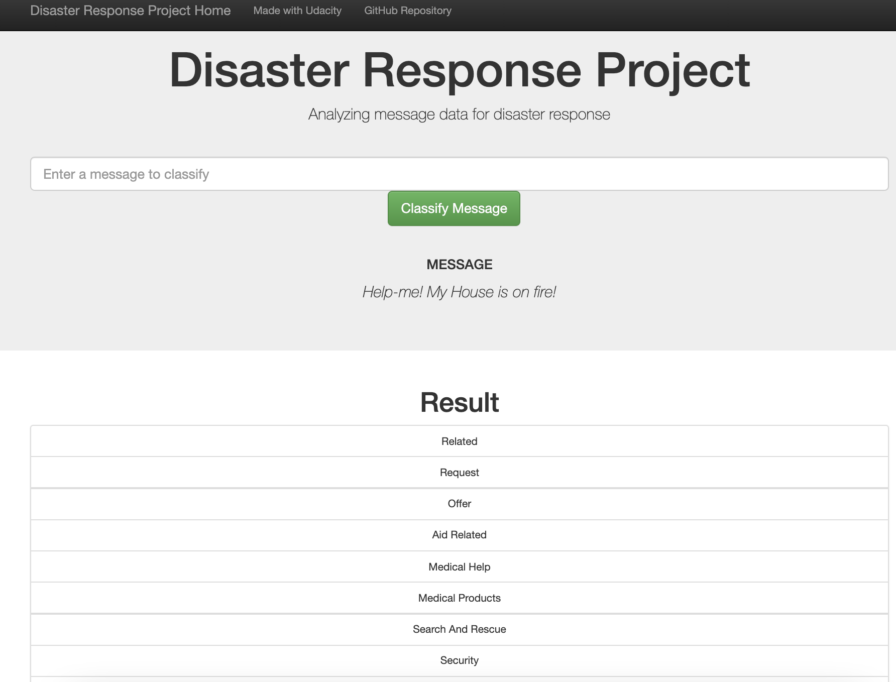
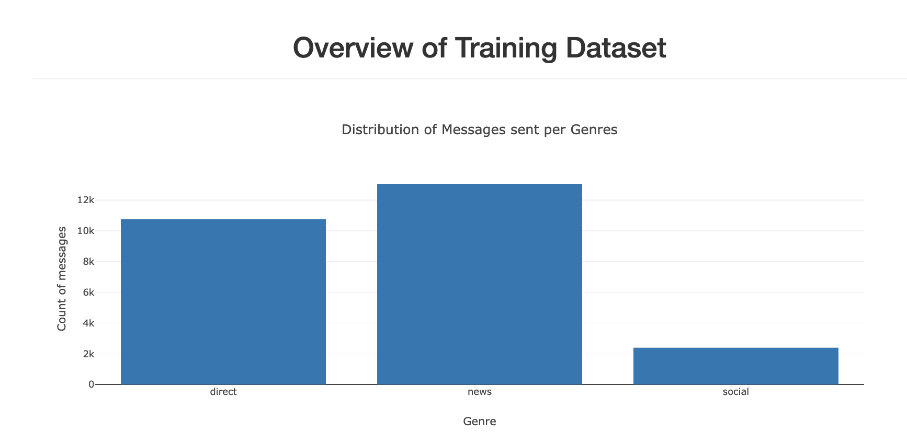
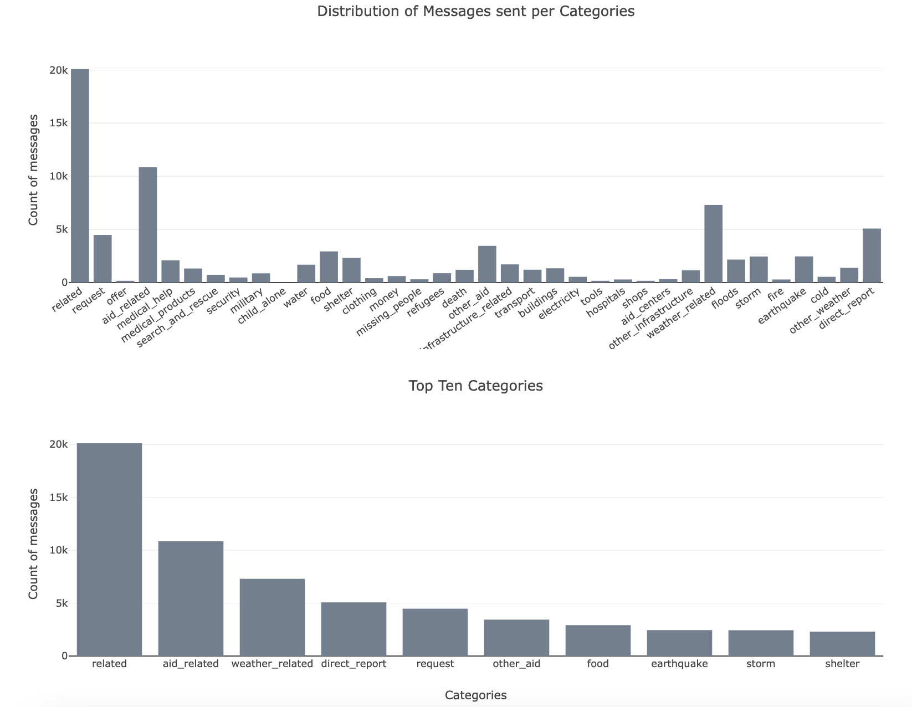
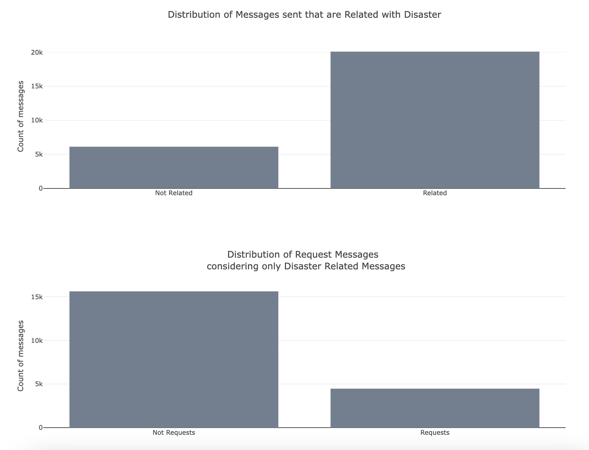

# Project 3: Disaster Response Pipeline
Udacity Data Scientist Nanodegree   Jean Carlos da Cruz

## Table of Contents
 * [Project Motivation](#project-motivation)
 * [File and Web APP Descriptions](#file-descriptions)
 * [Instructions of How to Interact With Project](#instructions-of-how-to-interact-with-project)
 
### Project Motivation
This project is part of the Udacity's Data Scientist nanodegree program. In order to achive the desired results we should use our recent acquired data engineering skills to analyze disaster data from [Figure Eight] to build a model for an API that classifies disaster messages. We should also create a machine learning pipeline (Also learned in this part of the course using Sckit Learn and GridCV) to categorize real messages that were sent during disaster events so that the messages could be sent to an appropriate disaster relief agency. The final product of the project should be a web interface where an emergency worker can input a new message and get classification results in several categories. The web app  should also display custom visualizations of the data.

### File Descriptions
app    

| - templates    
| |- master.html # HTML main page of the web app    
| |- go.html # HTML classification result page of the web app    
|- run.py # Flask file that runs app    

data    

|- disaster_categories.csv # Data source containing disaster categories used in the model   
|- disaster_messages.csv # Data Source containing the disaster messages used in the model  
|- Disaster_Response.db # SQLite database with cleaned data stored.  
|- process_data.py # data cleaning pipeline used in the app writes a data cleaning pipeline that:

 - Loads the messages and categories datasets
 - Merges the two datasets
 - Cleans the data
 - Stores it in a SQLite database    
   

models   

|- train_classifier.py # Python machine learning pipeline that:

 - Loads data from the SQLite database
 - Splits the dataset into training and test sets
 - Builds a text processing and machine learning pipeline
 - Trains and tunes a model using GridSearchCV
 - Outputs results on the test set
 - Exports the final model as a pickle file     

Notebooks 

|- A jupyter notebook `ETL Pipeline Preparation` was used to do EDA to prepare the process_data.py python script. 

|- A jupyter notebook `ML Pipeline Preparation` was used to do EDA to prepare the train_classifier.py python script. 

#### Flask Web App Description
The project includes a web app where an emergency worker can input a new message and get classification results in several categories. The web app will also display visualizations of the data. Output examples are shown below:

### Instructions of How to Interact With Project:
1. Run the following commands in the project's root directory to set up your database and model.

    - To run ETL pipeline that cleans data and stores in database
        `python process_data.py disaster_messages.csv disaster_categories.csv Disaster_Response.db`
    - To run ML pipeline that trains classifier and saves it
        `python train_classifier.py ../data/Disaster_Response.db classifier.pkl`

2. Run the following command in the app's directory to run your web app.
    `python run.py`

3. Go to http://0.0.0.0:3001/
